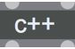

 MaxCpp
==========================


A C++ template single-header file for constructing Max/MSP externals from C++ classes, in a friendly and readable manner. The core notion is that an instance of the external is encapsulated by an instance of the C++ class. Most of the mechanics of typical max objects are encapsulated by the curiously recurring template pattern.

Updated and Tested (on Mac OSX) by Francesco Perticarari

Copyright (c) 2017

Updated and tested against Max 7 (2017). 
The previous version (base for this one) - which should be always credited - is hosted on this [GitHub repo](https://github.com/grrrwaaa/maxcpp), 

## Using

To develop Max/MSP projects, you will first need the Max SDK, available [on github](https://github.com/Cycling74/max-sdk))

The source trunk includes headers, examples and Xcode project / Visual C++ project files (note: the Visual Studio files have NOT BEEN ADAPTED! They are a legacy from MaxCpp6 and HAVE NOT BEEN MODIFIED SINCE, NOR TESTED!!!). The XCode example projects should work 'out of the box' if the this repo is placed inside your MaxSDK folder (next to the source folder). 

## Setup

1) Download the Max 7 SDK

2) Download (or git clone) this repo into the SDK main folder ( at the same level of source )

3) In the examples folder you will find a max, an msp and jbox external examples - they can be compiled an should work out-of-the-box

4) In "MyExternals" you can craft your own externals. I left there, for illustration purposes, the beginning of an external that I started by copying the msp "example~" project folder into "MyExternals" and modyfing it.

5) To give your external a unique name: rename the XCode project (if you do it externally make sure to re-define the compilation targets), change the name of the max class created in "main()" with a matching one, then rename the cpp file and -if you want- the wrapper class name.

6) You can now work as you like: I usually extract main() into a different cpp file, associate headers files with this and the initial cpp, then start adding other cpp+header files, libraries, etc. 

7) Note on libraries: if they are compiled, make sure their compilation architecture and compiler specifications match the one you are working with in this project (you can check them out in the "xcconfig" file or in the project settings in XCode)


## Disclaimer

Since the source files will be C++, the ```main``` function needs to be qualified with ```extern "C"```.

Caveats: it almost surely won't work with virtuals or multiple inheritance. Also be careful not to include the header twice, or there'll be linker errors for duplicate m_class symbols.

Thanks to Graham Wakefield for his amazing work to create the original maxcpp6

A basic version of a c++ project for a Max external, which is what this and the original maxcpp6 use for basis, is included in the Max 7 SDK (folder: max-sdk/source/advanced/collect)

## Sample code (Max object)

```cpp
#include "maxcpp.h"

class Example : public MaxCpp<Example> {
public:
	Example(t_symbol * sym, long ac, t_atom * av) { 
		setupIO(2, 2); // inlets / outlets
	}
	~Example() {}	
	
	// methods:
	void bang(long inlet) { 
		outlet_bang(m_outlets[0]);
	}
	void testfloat(long inlet, double v) { 
		outlet_float(m_outlets[0], v);
	}
	void testint(long inlet, long v) { 
		outlet_int(m_outlets[0], v);
	}
	void test(long inlet, t_symbol * s, long ac, t_atom * av) { 
		outlet_anything(m_outlets[1], gensym("test"), ac, av); 
	}
};

C74_EXPORT extern "C" int main(void) {
	// create a class with the given name:
	Example::makeMaxClass("example");
	REGISTER_METHOD(Example, bang);
	REGISTER_METHOD_FLOAT(Example, testfloat);
	REGISTER_METHOD_LONG(Example, testint);
	REGISTER_METHOD_GIMME(Example, test);
}
```

## Sample code (MSP object)

```cpp
#include "maxcpp.h"

// inherit from the MSP base class, template-specialized for myself:

class Example : public MspCpp<Example> {
public:

	Example(t_symbol * sym, long ac, t_atom * av) { 
		setupIO(2, 2); 
	}
	
	~Example() {}	
	
	// methods:
	void bang(long inlet) { 
		post("bang in inlet %i!", inlet); 
	}
	
	void test(long inlet, t_symbol * s, long ac, t_atom * av) { 
		post("%s in inlet %i (%i args)", s->s_name, inlet, ac);
	}
	
	// default signal processing method is called 'perform'
	void perform(double **ins, long numins, double **outs, long numouts, long sampleframes) {
		// example code to invert inputs
		for (long channel = 0; channel < numouts; channel++) {
			double * in = ins[channel];
			double * out = outs[channel];
			for (long i=0; i < sampleframes; i++) {
				out[i] = -in[i];
			}
		}
	}
};

C74_EXPORT extern "C" int main(void) {
	// create a class with the given name:
	Example::makeMaxClass("example~");
	REGISTER_METHOD(Example, bang);
	REGISTER_METHOD_GIMME(Example, test);
}
```

## Licence

This version of maxcpp has been updated for Max 7 (and Max 7 sdk) by Francesco Perticarari

The previous version (for Max 6 sdk), which this upgrade has barely changed, can be found [here](https://github.com/grrrwaaa/maxcpp)

maxcpp is distributed under its original open-source BSD-like MIT licence:

Copyright (c) 2009-2013 Graham Wakefield

Permission is hereby granted, free of charge, to any person obtaining a copy
of this software and associated documentation files (the "Software"), to deal
in the Software without restriction, including without limitation the rights
to use, copy, modify, merge, publish, distribute, sublicense, and/or sell
copies of the Software, and to permit persons to whom the Software is
furnished to do so, subject to the following conditions:

The above copyright notice and this permission notice shall be included in
all copies or substantial portions of the Software.

THE SOFTWARE IS PROVIDED "AS IS", WITHOUT WARRANTY OF ANY KIND, EXPRESS OR
IMPLIED, INCLUDING BUT NOT LIMITED TO THE WARRANTIES OF MERCHANTABILITY,
FITNESS FOR A PARTICULAR PURPOSE AND NONINFRINGEMENT. IN NO EVENT SHALL THE
AUTHORS OR COPYRIGHT HOLDERS BE LIABLE FOR ANY CLAIM, DAMAGES OR OTHER
LIABILITY, WHETHER IN AN ACTION OF CONTRACT, TORT OR OTHERWISE, ARISING FROM,
OUT OF OR IN CONNECTION WITH THE SOFTWARE OR THE USE OR OTHER DEALINGS IN
THE SOFTWARE.
